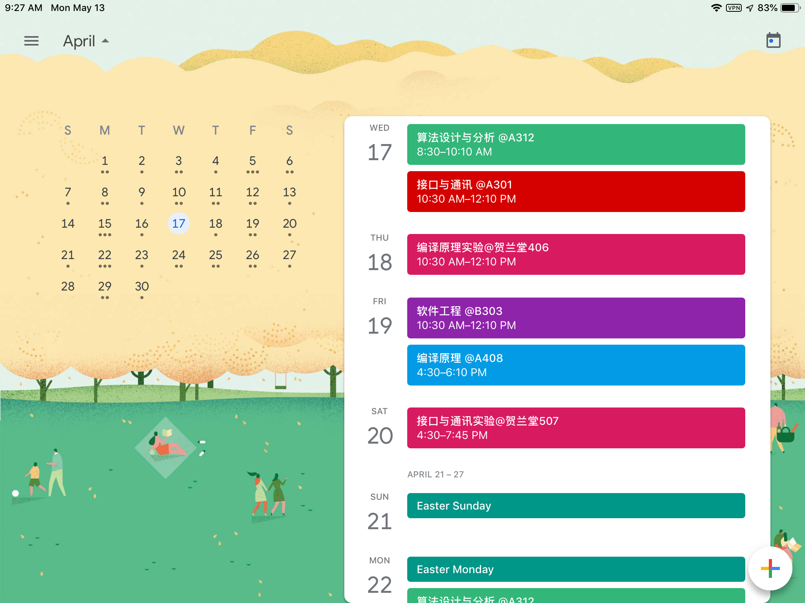

# LZU-Course-to-icalender
[中文介绍点这里](https://github.com/RoseauHan/lzu-course-to-icalender/blob/master/README-CN.md)

Login in to lanzhou university's website to get course infomation and then automatically output an icalender file, which you can add it to your universal calender, such as Google Calender, Apple Calender and so on.    
Please feel free to enjoy yourself！

 
[More pic show](https://github.com/RoseauHan/lzu2ics/blob/master/img/README.md)

## What is icalender ？
[iCalendar](https://icalendar.org/) is a standard method of transferring calendar information between computer systems. The standard allows products from many vendors to transfer calendar information between each other.  iCalendar files typically have the file extension ".ical" ".ics" ".ifb"  or ".icalendar" with a MIME type of "text/calendar".

## INSTALLATION

You need to install python 3 first.

```Shell
brew install python3
```

Second, you need install beautifulsoup4 and icalendar by pip (pip3).

```shell
pip install beautifulsoup4
pip install icalendar
```

## USAGE

```shell
python3 lzu2icalender.py
```
then, follow the terminal hint.


## Known issues so far
- if using windows's python Interpreter, the output file may have blank lines, which will occur error.
- google calender may can't import the output.ics file, you can uninstall and install again to solve this problem sometimes……

## TODO list
- [ ] Compatible with more calendar formats
- [ ] output all available calender at one time.
- [ ] provide a beaufiful front-end website.
- [ ] Using google's calender api，add to google calender event online.
- [ ] Object-oriented reconstruction

## Others
all issues are welcome.

# LICENSE 

GPL-3.0
